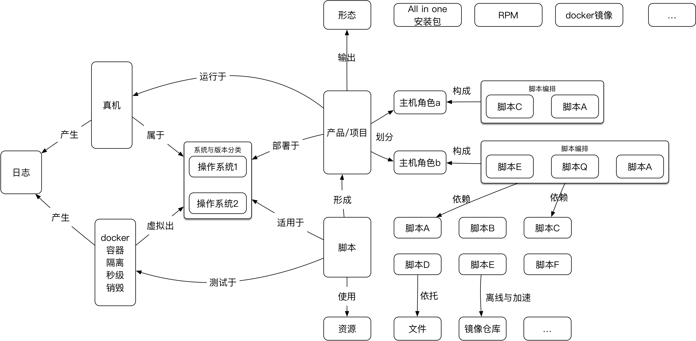

## SMARTO （smart auto）

### Features
1. script supermarket
2. hosts management
3. project template：machine grouping 、script ordering、variables customizing、project exporting
4. easy sandbox testing
5. multi hosts resources delivery and batch scripts execute
6. batch logs gathering
7. mirror management and export for offline situation

### Architecture

### Screen Snapshots
